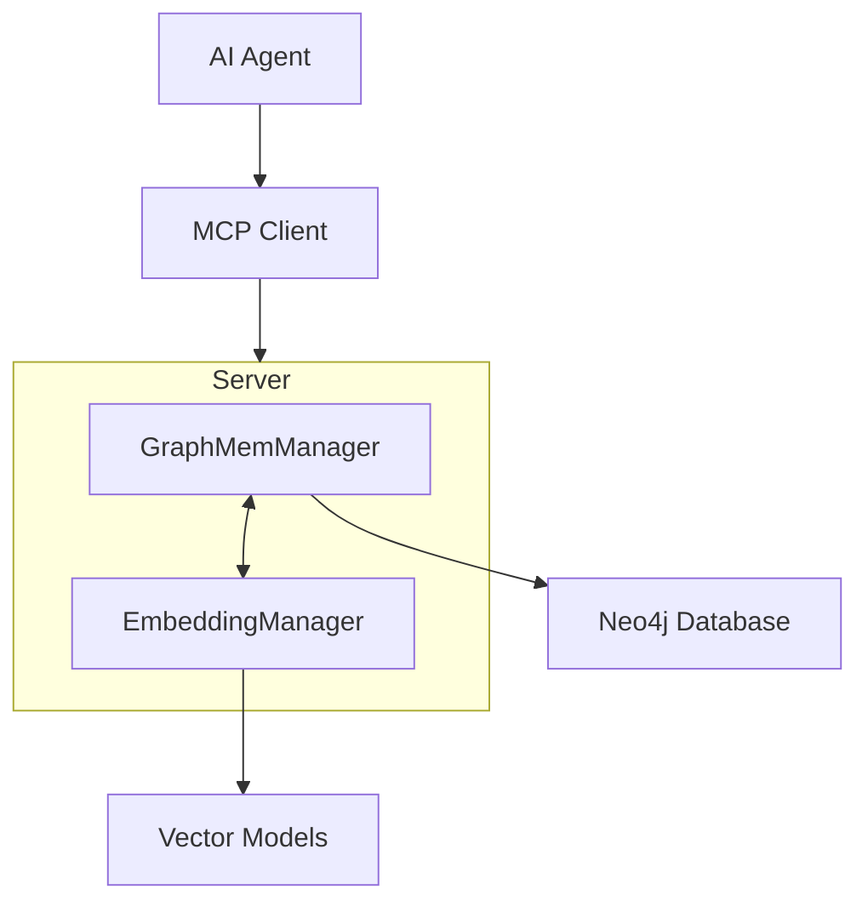

# Neo4j MCP Graph Memory Server

This project provides a graph-based memory system for AI agents using Neo4j as the backend database. It allows storing, retrieving, and querying entity information with support for vector embeddings for semantic search.

## Introduction

The Neo4j MCP Graph Memory Server is a specialized persistence layer designed for AI agents that need to remember information over time. Built on Neo4j's graph database, it enables AI systems to:

- Build and maintain knowledge graphs of entities and their relationships
- Store observations about entities in a structured format
- Perform semantic searches using vector embeddings
- Maintain context across multiple interactions

This project bridges the gap between ephemeral AI conversations and long-term knowledge storage, allowing AI agents to grow more intelligent and contextually aware over time.

## Server Modes

The server supports two distinct operating modes:

### stdio Mode

In this mode, the server operates through standard input/output, making it ideal for:
- Direct integration with AI agents running in the same process
- Simple deployments without network configuration
- Single client scenarios
- Development and testing environments

### SSE (Server-Sent Events) Mode

In this mode, the server runs as a persistent web service, which enables:
- Multiple simultaneous client connections
- Network-based deployments
- Longer-running sessions
- Non-disruptive configuration changes
- Enterprise and production deployments

## Architecture

The Neo4j MCP Memory Server consists of several core components:

1. **Neo4j Database**: Stores entities, relationships, and observations in a graph structure
2. **Vector Embedding Service**: Converts text into numerical vectors for semantic search (optional)
3. **MCP Server Interface**: Provides standardized tools for AI agents to interact with the memory system
4. **GraphMemoryManager**: Manages database connections and operations
5. **EmbeddingManager**: Handles vector embedding generation and configuration



## Features

- Store entities, observations, and relationships in a Neo4j graph database
- Vector embeddings for semantic search (optional)
- Support for multiple embedding providers:
  - OpenAI
  - Azure OpenAI
  - HuggingFace
  - Vertex AI (Google Cloud)
  - Gemini (Google)
  - Mistral AI
  - Ollama
  - LMStudio
- MCP server interface for agent integration
- Support for both SSE and stdio operation modes
- Non-disruptive reinitialization in SSE mode that preserves client connections

## Requirements

- Python 3.11+
- Neo4j 5.11+ (for vector indexing)
- Poetry (package manager)

## Installation

1. Clone the repository
2. Install dependencies using Poetry:

```bash
# Install base dependencies
poetry install

# If you need specific embedding providers, install their dependencies:
./install_embedding_deps.sh
# Or set the EMBEDDING_PROVIDER environment variable:
EMBEDDING_PROVIDER=openai ./install_embedding_deps.sh
```

## Configuration

Configuration is done through environment variables. You can set these in a `.env` file or directly in your environment.

### Core Configuration

- `NEO4J_URI`: URI for the Neo4j database (default: `bolt://localhost:7687`)
- `NEO4J_USER`: Neo4j username (default: `neo4j`)
- `NEO4J_PASSWORD`: Neo4j password (default: `password`)
- `NEO4J_DATABASE`: Neo4j database name (default: `neo4j`)
- `USE_SSE`: Use Server-Sent Events for MCP interface (default: `false`)
- `PORT`: Port for SSE server (default: `8080`)
- `LOG_LEVEL`: Logging level (default: `info`)

### Embedding Configuration

- `EMBEDDER_PROVIDER`: Embedding provider to use (default: `none`)
  - Options: `openai`, `azure_openai`, `huggingface`, `ollama`, `vertexai`, `gemini`, `mistral`, `lmstudio`, `none`
- `EMBEDDING_DIMS`: Dimensions of the embeddings (defaults vary by provider)

#### Provider-Specific Configuration

**OpenAI**
- `OPENAI_API_KEY`: OpenAI API key
- `EMBEDDING_MODEL`: Model to use (default: `text-embedding-3-small`)
- `OPENAI_API_BASE`: Custom API base URL (optional)

**Azure OpenAI**
- `AZURE_API_KEY`: Azure OpenAI API key
- `AZURE_DEPLOYMENT`: Azure OpenAI deployment name
- `AZURE_ENDPOINT`: Azure OpenAI endpoint URL
- `AZURE_MODEL`: Model to use (default: `text-embedding-3-small`)
- `AZURE_API_VERSION`: API version (default: `2023-05-15`)

**HuggingFace**
- `HUGGINGFACE_API_KEY`: HuggingFace API key (needed for hosted models)
- `HUGGINGFACE_MODEL`: Model to use (default: `sentence-transformers/all-mpnet-base-v2`)
- `HUGGINGFACE_MODEL_KWARGS`: JSON string of kwargs for the model (default: `{"device":"cpu"}`)

**Vertex AI**
- `GOOGLE_APPLICATION_CREDENTIALS`: Path to Google credentials JSON file
- `VERTEXAI_MODEL`: Model to use (default: `text-embedding-004`)
- `VERTEX_PROJECT`: Google Cloud project ID
- `VERTEX_LOCATION`: Google Cloud region (default: `us-central1`)

**Gemini**
- `GOOGLE_API_KEY`: Google API key
- `GEMINI_MODEL`: Model to use (default: `models/text-embedding-004`)

**Mistral**
- `MISTRAL_API_KEY`: Mistral API key
- `MISTRAL_MODEL`: Model to use (default: `mistral-embed`)

**Ollama**
- `OLLAMA_MODEL`: Model to use (default: `llama2`)
- `OLLAMA_BASE_URL`: Ollama base URL (default: `http://localhost:11434`)

**LMStudio**
- `LMSTUDIO_BASE_URL`: LMStudio base URL (default: `http://localhost:1234`)

## Usage

### Starting the Server

```bash
# Start with default settings (stdio mode, no embeddings)
./start_memory_server.sh

# Start with SSE mode
USE_SSE=true ./start_memory_server.sh

# Start with embeddings enabled
EMBEDDER_PROVIDER=openai OPENAI_API_KEY=your_api_key ./start_memory_server.sh
```

### Using with Docker

A Docker Compose configuration is provided in `docker-compose.yml`:

```bash
# Start Neo4j and the memory server
docker-compose up -d
```

## Entity Operations

Entities are the primary nodes in the knowledge graph. They represent people, places, concepts, or any other object that an AI agent needs to remember.

### Creating Entities

Entities require a name, type, and optional observations:

```python
entities = [
    {
        "name": "Alice Smith",
        "entityType": "Person",
        "observations": [
            "Works as a software engineer",
            "Lives in San Francisco"
        ]
    }
]

result = await client.call_tool("create_entities", {"entities": entities})
```

### Retrieving Entities

To retrieve specific entities by name:

```python
result = await client.call_tool("open_nodes", {"names": ["Alice Smith", "Google"]})
```

### Deleting Entities

To delete an entity and all its relationships:

```python
result = await client.call_tool("delete_entity", {"name": "Alice Smith"})
```

## Relation Operations

Relations connect entities in the graph, establishing semantic connections between them.

### Creating Relations

Relations require source entity, target entity, and a relation type:

```python
relations = [
    {
        "from": "Alice Smith",
        "to": "Google",
        "relationType": "WORKS_AT"
    }
]

result = await client.call_tool("create_relations", {"relations": relations})
```

### Deleting Relations

To delete a specific relation between entities:

```python
result = await client.call_tool("delete_relation", {
    "from": "Alice Smith",
    "to": "Google",
    "relationType": "WORKS_AT"
})
```

## Observation Operations

Observations are facts or statements about entities that are stored as properties.

### Adding Observations

Add new observations to existing entities:

```python
observations = [
    {
        "entity": "Alice Smith",
        "content": "Recently promoted to Senior Engineer"
    }
]

result = await client.call_tool("add_observations", {"observations": observations})
```

### Deleting Observations

Remove a specific observation from an entity:

```python
result = await client.call_tool("delete_observation", {
    "entity": "Alice Smith",
    "content": "Lives in San Francisco"
})
```

## Search Operations

Search operations allow querying the knowledge graph for relevant information.

### Basic Search

When embeddings are disabled, basic keyword search is used:

```python
result = await client.call_tool("search_nodes", {"query": "software engineer"})
```

### Semantic Search

When embeddings are enabled, semantic search uses vector similarity:

```python
# This will find entities related to "tech professionals" even if those exact words aren't used
result = await client.call_tool("search_nodes", {"query": "tech professionals in California"})
```

### Limiting Results

Control the number of results returned:

```python
result = await client.call_tool("search_nodes", {"query": "software engineer", "limit": 5})
```

## Memory Management

The server provides tools for managing the knowledge graph as a whole.

### Setting Project Name

Projects provide logical separation of knowledge graphs:

```python
result = await client.call_tool("set_project_name", {"project_name": "my-project"})
```

### Retrieving All Memories

Get a full dump of all entities and observations in the graph:

```python
result = await client.call_tool("get_all_memories", {})
```

### Clearing All Memories

Delete all data in the knowledge graph (use with caution):

```python
result = await client.call_tool("delete_all_memories", {})
```

## Client-Side Configuration

Clients should save configuration details to maintain consistent interactions with the server.

### Embedding Configuration

The server provides configuration details that clients should save:

```python
config = {
    "provider": "openai",
    "model": "text-embedding-3-small",
    "api_key": "your-api-key",
    "project_name": "my-project"
}

result = await client.call_tool("configure_embedding", config)
# Client should save the returned configuration to a file like:
# mcp_memory_config_my-project.json
```

### Project Configuration

When setting a project name without changing embedding settings:

```python
result = await client.call_tool("set_project_name", "my-project")
# Client should save the returned configuration to a file like:
# mcp_project_config_my-project.json
```

## Response Format with AI Agent Instructions

The server's responses include specific instructions for AI agents to follow. These instructions help the agent properly use and maintain the configuration.

For example, after configuring embeddings, the response includes:

```json
{
  "status": "success",
  "message": "Successfully configured embedding provider: openai",
  "provider": "openai",
  "project_name": "my-project",
  "embedding_enabled": true,
  "config": { ... },
  "instructions_for_agent": "IMPORTANT: Save this configuration to 'mcp_memory_config_my-project.json' in the root directory of your project. This file will be used for future memory operations with the MCP server. Embeddings are currently enabled. You should use this configuration whenever interacting with the memory graph for project 'my-project'.",
  "file_name": "mcp_memory_config_my-project.json"
}
```

AI agents should parse this response and follow the instructions to maintain a consistent memory environment.

## Using with Cursor

The Neo4j MCP Graph Memory Server integrates seamlessly with [Cursor](https://cursor.sh), providing AI-powered development capabilities:

1. **Setup Cursor with MCP**:
   - Clone this repository into your Cursor workspace
   - Run the server in SSE mode: `USE_SSE=true ./start_memory_server.sh`
   - Configure Cursor to use the MCP server as a tool provider

2. **Cursor Agent Memory**:
   - The agent can use MCP tools to remember information about your project
   - Code structure, requirements, and design decisions can be stored in the graph
   - Information persists across Cursor sessions

3. **Example Rule Configuration**:
   ```
   // In .cursor/rules/mcp-tools.mdc
   ---
   description: Rules for interacting with the MCP Memory Server
   globs: **/*.{py,js,ts}
   ---
   # MCP Memory Rules
   
   When analyzing code, store key insights in the memory graph:
   - Important classes/functions as entities
   - Dependencies between components as relations
   - Design patterns and architectural decisions as observations
   ```

## Claude Desktop Usage

The Neo4j MCP Graph Memory Server can be integrated with Claude Desktop for persistent memory:

1. **Starting the Server**:
   - Run the server in SSE mode: `USE_SSE=true ./start_memory_server.sh`
   - Ensure the server is accessible to Claude Desktop

2. **Claude Integration**:
   - Configure Claude with an API tool that points to the MCP server
   - Use conversation starters that prompt Claude to use the memory system

3. **Usage Pattern**:
   - Claude analyzes user queries and stores relevant information in the graph
   - For recurring topics, Claude retrieves previous context from memory
   - Claude can build a knowledge graph of user preferences and information over time

4. **Example Prompt**:
   ```
   You have access to a memory system through the MCP API. 
   When users share important information about themselves or their work, 
   store it in the memory graph using the create_entities and add_observations tools.
   When users ask questions, first check if relevant information exists in memory
   using the search_nodes tool.
   ```

## Custom AI Instructions

The Neo4j MCP Graph Memory Server can significantly enhance AI agent capabilities by providing structured memory. The following instructions guide an AI on how to effectively use the memory system for project development knowledge and agent learning:

### Memory Process Instructions

Follow these steps for each project interaction:

1. **Project Context Identification**:
   - Identify the current project by name (e.g., "customer-portal", "data-pipeline")
   - Set the project name using `set_project_name` if not already configured
   - Associate all memories with this project context

2. **Knowledge Retrieval**:
   - Before suggesting solutions or writing code, search the memory graph for relevant context
   - Query for project requirements, architectural decisions, or previous implementation details
   - Example: `search_nodes("authentication implementation")`
   - Reference found memories in your responses with "Based on project history..."

3. **Knowledge Categorization**:
   - While analyzing the codebase or user requests, categorize important information as:
     a) **Project Structure** - Architecture, design patterns, component relationships
     b) **Technical Decisions** - Technology choices, algorithms, implementation approaches
     c) **Dependencies** - Libraries, frameworks, services, APIs being used
     d) **Requirements** - User stories, acceptance criteria, constraints
     e) **Lessons Learned** - Previous bugs, performance issues, refactoring insights

4. **Memory Graph Updates**:
   - Update the memory graph with new knowledge using appropriate entities and relations:
     a) Create component entities: `create_entities([{"name": "AuthService", "entityType": "Component", "observations": ["Handles user authentication", "Uses JWT tokens"]}])`
     b) Establish dependency relations: `create_relations([{"from": "AuthService", "to": "jsonwebtoken", "relationType": "DEPENDS_ON"}])`
     c) Document lessons: `add_observations([{"entity": "AuthService", "content": "Token refresh caused race condition when multiple tabs open"}])`

5. **Package and Dependency Documentation**:
   - When new dependencies are introduced:
     a) Create an entity for each significant package or library
     b) Record version info: `{"name": "React", "entityType": "Library", "observations": ["Using v18.2.0", "Handles UI rendering"]}`
     c) Document integration points: `{"from": "FrontendApp", "to": "React", "relationType": "USES"}`
     d) Note compatibility issues: `{"entity": "React", "content": "Requires Node 14+ to build"}`

6. **Agent Self-Improvement**:
   - Record solution patterns and mistakes for future reference:
     a) Success patterns: `{"name": "PaginationPattern", "entityType": "Pattern", "observations": ["Implemented using cursor-based approach", "Handles large datasets efficiently"]}`
     b) Bug patterns: `{"name": "StateRaceCondition", "entityType": "BugPattern", "observations": ["Occurred when async state updates weren't properly sequenced"]}`
     c) Link issues to solutions: `{"from": "StateRaceCondition", "to": "UseReducerPattern", "relationType": "SOLVED_BY"}`

### Example AI Reasoning Process

```
User: "We need to implement JWT authentication for our API"

AI (thinking): Let me check if we have existing knowledge about authentication in this project.
[searches memory: search_nodes("JWT authentication API")]

Found: {
  "name": "AuthImplementation",
  "entityType": "Decision",
  "observations": ["Team decided to use jsonwebtoken library", "Tokens should expire after 1 hour", "Refresh tokens required"]
}

AI: "Based on project history, the team has already decided to use the jsonwebtoken library with 1-hour expiration and refresh token support. I'll implement the authentication service following these requirements..."

[after implementation]

AI (thinking): Let me update the memory with this new implementation.
[creates entity: {"name": "AuthService", "entityType": "Component", "observations": ["Implements JWT using jsonwebtoken", "Handles token refresh logic"]}]
[creates relation: {"from": "AuthService", "to": "jsonwebtoken", "relationType": "IMPLEMENTS"}]
```

## API Methods

The server exposes several MCP tool methods:

- `create_entities`: Create entities in the graph
- `create_relations`: Create relations between entities
- `add_observations`: Add observations to entities
- `search_nodes`: Search for entities (with semantic search if embeddings enabled)
- `open_nodes`: Retrieve specific entities by name
- `delete_entity`: Delete an entity
- `delete_relation`: Delete a relation
- `delete_observation`: Delete an observation
- `get_all_memories`: Get all entities and observations
- `delete_all_memories`: Delete all data in the graph
- `configure_embedding`: Configure embedding provider dynamically
- `get_embedding_config`: Get the current embedding configuration
- `set_project_name`: Set the project name for memory operations

### Tool Examples

#### Creating Entities

```python
entities = [
    {
        "name": "Alice Smith",
        "entityType": "Person",
        "observations": [
            "Works as a software engineer",
            "Lives in San Francisco",
            "Graduated from Stanford University in 2015"
        ]
    },
    {
        "name": "Google",
        "entityType": "Organization",
        "observations": [
            "Technology company founded in 1998",
            "Headquartered in Mountain View, California"
        ]
    }
]

result = await client.call_tool("create_entities", entities)
```

#### Creating Relations

```python
relations = [
    {
        "from": "Alice Smith",
        "to": "Google",
        "relationType": "WORKS_AT"
    },
    {
        "from": "Bob Jones",
        "to": "Alice Smith",
        "relationType": "KNOWS"
    }
]

result = await client.call_tool("create_relations", relations)
```

#### Adding Observations

```python
observations = [
    {
        "entity": "Alice Smith",
        "content": "Recently promoted to Senior Engineer"
    },
    {
        "entity": "Google",
        "content": "Developing new AI technology"
    }
]

result = await client.call_tool("add_observations", observations)
```

#### Semantic Search

```python
# With vector embeddings enabled
query = "Who works in tech companies?"
result = await client.call_tool("search_nodes", {"query": query, "limit": 5})
```

#### Configuring Embeddings

```python
config = {
    "provider": "openai",
    "model": "text-embedding-3-small",
    "api_key": "your-api-key",
    "dimensions": 1536,
    "project_name": "my-project"
}

result = await client.call_tool("configure_embedding", config)
```

## Client Example

Here's a complete example of a client interacting with the MCP server:

```python
import asyncio
import json
from mcp import Client
from mcp.client.stdio import StdioClientTransport

async def main():
    # Create a client transport
    transport = StdioClientTransport(
        command="python",
        args=["path/to/neo4j_mcp_server.py"],
        env={
            "NEO4J_URI": "bolt://localhost:7687",
            "NEO4J_USER": "neo4j",
            "NEO4J_PASSWORD": "password",
            "NEO4J_DATABASE": "neo4j",
            "EMBEDDER_PROVIDER": "openai",
            "OPENAI_API_KEY": "YOUR_API_KEY"
        }
    )

    # Create and connect the client
    client = Client(name="example-client", version="1.0.0")
    await client.connect(transport)

    # Configure the project
    await configure_project(client, "example-project")

    # Create entities
    await create_entities(client)

    # Search the graph
    await search_graph(client, "Who works at Google?")

    # Disconnect the client
    await client.disconnect()

async def configure_project(client, project_name):
    config = {
        "provider": "openai",
        "project_name": project_name,
    }
    result = await client.call_tool("configure_embedding", config)
    print(json.dumps(json.loads(result), indent=2))

async def create_entities(client):
    entities = [
        {
            "name": "John",
            "entityType": "Person",
            "observations": ["is a developer", "lives in New York"]
        },
        {
            "name": "Google",
            "entityType": "Company",
            "observations": ["tech company based in Mountain View"]
        }
    ]
    result = await client.call_tool("create_entities", entities)
    print(json.dumps(json.loads(result), indent=2))

async def search_graph(client, query):
    result = await client.call_tool("search_nodes", {"query": query})
    print(json.dumps(json.loads(result), indent=2))

if __name__ == "__main__":
    asyncio.run(main())
```

## Using with LangChain and LiteLLM

The server can be integrated with LangChain for more complex LLM applications:

```python
from src.litellm_langchain import LiteLLMEmbeddings
from langchain_neo4j import Neo4jVector
from langchain.docstore.document import Document

# Initialize embeddings
embeddings = LiteLLMEmbeddings(
    model="openai/text-embedding-3-small",
    api_key="your-api-key",
    dimensions=1536
)

# Create vector store
vector_store = Neo4jVector(
    embedding=embeddings,
    url="bolt://localhost:7687",
    username="neo4j",
    password="password",
    database="neo4j",
    index_name="document_embeddings",
    node_label="Document",
    text_node_property="content"
)

# Add documents
documents = [
    Document(page_content="Neo4j is a graph database management system.", 
             metadata={"source": "wiki", "category": "database"}),
    Document(page_content="Vector embeddings represent text as vectors.", 
             metadata={"source": "article", "category": "ml"})
]
vector_store.add_documents(documents)

# Perform search
results = vector_store.similarity_search("How do graph databases work?", k=2)
```

## SSE Mode Benefits

When running in SSE mode (`USE_SSE=true`), the server maintains persistent connections with clients. Key benefits include:

- **Multiple Client Support**: Multiple AI agents can connect to the same MCP server instance
- **Non-disruptive Reconfiguration**: When a client changes embedding settings, other connected clients are not impacted
- **Connection Preservation**: Database connections are maintained efficiently using connection pooling

## License

MIT
