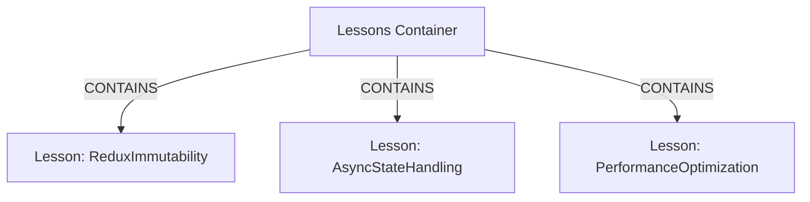
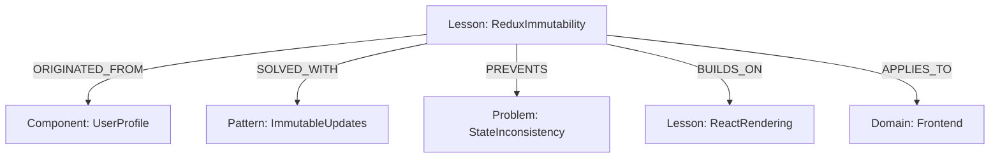

# Lessons Memory System Implementation

## Overview

The Lessons Memory system is designed to capture, organize, and utilize knowledge gained from experience in a way that mimics human learning. This document outlines the implementation details for an enhanced lesson-based memory system within the Neo4j Graph Memory architecture.

## Core Concepts

### Lesson Container

A global container that collects all lessons across projects:

```cypher
CREATE (lc:MemoryContainer {name: "Lessons", type: "LessonsContainer", description: "Global container for all lessons learned"})
```



### Lesson Entity Structure

Each lesson entity should contain:

| Property | Type | Description |
|----------|------|-------------|
| name | String | Unique identifier for the lesson |
| entityType | String | Always "Lesson" |
| context | String | Where/when the lesson was encountered |
| dateEncountered | Date | When the lesson was first learned |
| problemDescription | String | Description of the problem that led to the lesson |
| impact | String | Severity/impact of the problem (High/Medium/Low) |
| resolution | String | Summary of how the problem was resolved |
| status | String | "Active", "Superseded", or "Deprecated" |
| version | Integer | Version number, incremented when lesson is updated |
| confidence | Float | Confidence level (0.0-1.0) in the lesson's validity |
| lastRefreshed | Date | When the lesson was last reinforced or reviewed |
| relevanceScore | Float | Dynamically calculated based on usage and references |
| source | String | Source of the lesson (Manual, Automated, Inferred) |

### Lesson Observations

Lessons should have structured observations:

1. **What Was Learned**
   - Factual knowledge gained
   - Technical insights
   - Patterns identified

2. **Why It Matters**  
   - Consequences of not applying the lesson
   - Benefits of applying the lesson
   - Contextual importance

3. **How To Apply**
   - Step-by-step application guidance
   - Code patterns or examples
   - Decision criteria

4. **Root Cause Analysis**
   - Underlying causes of the problem
   - Contributing factors
   - Technical or process failures

5. **Evidence and Examples**
   - Concrete examples demonstrating the lesson
   - Supporting data or metrics
   - Counter-examples (when it doesn't apply)

### Lesson Relationships

```cypher
// Origin relationship
(Lesson)-[:ORIGINATED_FROM]->(Component/Feature/Project)

// Solution relationship
(Lesson)-[:SOLVED_WITH]->(Pattern/Technique/Tool)

// Prevention relationship
(Lesson)-[:PREVENTS]->(Problem/AntiPattern)

// Learning progression
(Lesson)-[:BUILDS_ON]->(PriorLesson)

// Application context
(Lesson)-[:APPLIES_TO]->(Domain/Technology/Context)

// Update relationship
(NewLessonVersion)-[:SUPERSEDES]->(OldLessonVersion)

// Conflicting perspectives
(Lesson)-[:CONFLICTS_WITH {resolution: "Contextual"}]->(OtherLesson)

// Temporal connections
(Lesson)-[:PRECEDED_BY]->(EarlierLesson)

// Consolidation relationship
(MasterLesson)-[:CONSOLIDATES]->(ComponentLesson)
```



## Enhanced Implementation Details

### API Methods

#### 1. Create Lesson Container

```python
def create_lesson_container():
    """
    Create the global lessons container if it doesn't exist yet.
    """
    query = """
    MERGE (lc:MemoryContainer {name: "Lessons", type: "LessonsContainer"})
    ON CREATE SET lc.created = datetime(), 
                  lc.description = "Global container for all lessons learned"
    RETURN lc
    """
    # Execute query
```

#### 2. Create New Lesson

```python
def create_lesson(
    name,
    problem_description,
    context=None,
    impact="Medium",
    resolution=None,
    what_was_learned=None,
    why_it_matters=None,
    how_to_apply=None,
    root_cause=None,
    evidence=None,
    originated_from=None,
    solved_with=None,
    prevents=None,
    builds_on=None,
    applies_to=None,
    confidence=0.8,
    source="Manual"
):
    """
    Create a comprehensive lesson with all relevant information.
    """
    # 1. Create lesson entity
    # 2. Add observations
    # 3. Create relationships
    # 4. Add to lessons container
```

#### 3. Update Existing Lesson

```python
def update_lesson(
    lesson_name,
    updated_properties=None,
    updated_observations=None,
    new_relationships=None,
    update_confidence=True
):
    """
    Update a lesson, creating a new version that supersedes the old one.
    """
    # 1. Get existing lesson
    # 2. Create new version with incremented version number
    # 3. Copy existing properties and relationships, then apply updates
    # 4. Create SUPERSEDES relationship
    # 5. Update status of old version to "Superseded"
    # 6. Adjust confidence based on repeated reinforcement if update_confidence is True
```

#### 4. Retrieve Lessons

```python
def get_lessons(
    filter_criteria=None,
    related_to=None,
    applies_to=None,
    limit=50,
    include_superseded=False,
    min_confidence=0.0,
    sort_by="relevance"
):
    """
    Retrieve lessons based on various criteria.
    """
    # Implementation details for flexible lesson retrieval
```

#### 5. Apply Lesson to Context

```python
def apply_lesson_to_context(
    lesson_name,
    context_entity,
    application_notes=None,
    success_score=None
):
    """
    Record that a lesson was applied to a specific context.
    """
    # Create APPLIED_TO relationship with metadata
    # Update lesson's relevance score and possibly confidence based on outcome
```

#### 6. Automated Lesson Extraction

```python
def extract_potential_lessons(
    conversation_text=None,
    code_diff=None,
    issue_description=None,
    error_logs=None,
    min_confidence=0.6
):
    """
    Analyze various inputs to automatically extract potential lessons.
    
    Returns:
        List of extracted lesson candidates with confidence scores
    """
    # Use NLP to identify patterns indicating lessons
    # Look for problem-solution pairs
    # Extract context and impact information
    # Assign initial confidence based on extraction certainty
```

#### 7. Memory Consolidation

```python
def consolidate_related_lessons(
    lesson_ids,
    new_name=None,
    strategy="merge",
    confidence_handling="max"
):
    """
    Combine several related lessons into a more comprehensive one.
    
    Args:
        lesson_ids: List of lessons to consolidate
        new_name: Name for consolidated lesson (auto-generated if None)
        strategy: How to combine content ('merge', 'summarize')
        confidence_handling: How to set confidence ('max', 'avg', 'weighted')
    
    Returns:
        ID of the new consolidated lesson
    """
    # Retrieve all lessons to consolidate
    # Create new master lesson
    # Establish CONSOLIDATES relationships
    # Combine observations according to strategy
    # Set appropriate confidence level
    # Update all references to point to new lesson
```

#### 8. Temporal Intelligence

```python
def get_knowledge_evolution(
    entity_name=None,
    lesson_type=None,
    start_date=None,
    end_date=None,
    include_superseded=True
):
    """
    Track how knowledge has evolved over time.
    
    Returns:
        Timeline of lesson creations, updates, and applications
    """
    # Query lesson history with temporal constraints
    # Include version changes and application instances
    # Construct timeline of knowledge evolution
```

#### 9. Cross-Container Query

```python
def query_across_contexts(
    query_text,
    containers=None,  # Default to all containers
    confidence_threshold=0.0,
    relevance_threshold=0.0,
    limit_per_container=10
):
    """
    Execute unified search queries across different memory containers.
    
    Args:
        query_text: Search query text
        containers: List of container names to include (all if None)
        confidence_threshold: Minimum confidence level for returned results
        relevance_threshold: Minimum relevance score for returned results
        limit_per_container: Maximum results to return per container
        
    Returns:
        Unified results across containers with relevance scoring
    """
    # Parse query
    # Execute across specified containers
    # Combine and rank results
    # Return unified response
```

### Cypher Queries

#### Lesson Creation with Uncertainty Handling

```cypher
// Create lesson entity with confidence
CREATE (l:Entity:Lesson {
  name: $name,
  entityType: "Lesson",
  context: $context,
  dateEncountered: datetime(),
  problemDescription: $problem_description,
  impact: $impact,
  resolution: $resolution,
  status: "Active",
  version: 1,
  confidence: $confidence,
  source: $source,
  lastRefreshed: datetime(),
  relevanceScore: 1.0
})

// Add lesson to container
MATCH (lc:MemoryContainer {type: "LessonsContainer"})
MATCH (l:Lesson {name: $name})
MERGE (lc)-[:CONTAINS]->(l)

// Create observations with types
MATCH (l:Lesson {name: $name})
MERGE (o1:Observation {content: $what_was_learned, type: "WhatWasLearned"})
MERGE (l)-[:HAS_OBSERVATION]->(o1)
MERGE (o2:Observation {content: $why_it_matters, type: "WhyItMatters"})
MERGE (l)-[:HAS_OBSERVATION]->(o2)
// ... etc for other observation types
```

#### Temporal Intelligence Query

```cypher
// Get knowledge evolution timeline
MATCH (l:Lesson)
WHERE l.name CONTAINS $entity_name OR l.context CONTAINS $entity_name
WITH l
MATCH path = (l)-[:SUPERSEDES*0..]->(old:Lesson)
WITH l, old, length(path) as distance
WHERE distance = 0 OR old.dateEncountered >= $start_date
RETURN l.name as lesson,
       collect({
         version: old.version,
         date: old.dateEncountered,
         confidence: old.confidence,
         status: old.status
       }) as history
ORDER BY old.dateEncountered
```

#### Automated Knowledge Connection Query

```cypher
// Find potentially related lessons based on similarity
MATCH (l1:Lesson {name: $lesson_name})
MATCH (l2:Lesson)
WHERE l1 <> l2
WITH l1, l2,
     apoc.text.similarity(l1.problemDescription, l2.problemDescription) as problem_sim,
     apoc.text.similarity(
       coalesce((l1)-[:HAS_OBSERVATION]->(:Observation {type: "WhatWasLearned"}).content, ""),
       coalesce((l2)-[:HAS_OBSERVATION]->(:Observation {type: "WhatWasLearned"}).content, "")
     ) as learning_sim
WHERE problem_sim > 0.6 OR learning_sim > 0.7
RETURN l2.name as related_lesson,
       problem_sim + learning_sim as similarity_score
ORDER BY similarity_score DESC
LIMIT 5
```

#### Memory Consolidation Query

```cypher
// Create consolidated lesson
CREATE (master:Entity:Lesson {
  name: $new_name,
  entityType: "Lesson",
  context: $combined_context,
  dateEncountered: datetime(),
  problemDescription: $combined_description,
  impact: $highest_impact,
  resolution: $combined_resolution,
  status: "Active",
  version: 1,
  confidence: $calculated_confidence,
  source: "Consolidated",
  lastRefreshed: datetime(),
  relevanceScore: 1.0
})

// Create consolidation relationships
UNWIND $lesson_ids as lesson_id
MATCH (l:Lesson {name: lesson_id})
MERGE (master)-[:CONSOLIDATES]->(l)

// Set component lessons as consolidated
MATCH (master:Lesson {name: $new_name})-[:CONSOLIDATES]->(l:Lesson)
SET l.status = "Consolidated"

// Migrate existing relationships
MATCH (master:Lesson {name: $new_name})
MATCH (master)-[:CONSOLIDATES]->(l:Lesson)-[r:APPLIES_TO]->(target)
WHERE NOT exists((master)-[:APPLIES_TO]->(target))
CREATE (master)-[:APPLIES_TO]->(target)
```

#### Cross-Container Query

```cypher
// Query across containers
MATCH (container:MemoryContainer)
WHERE container.name IN $containers
MATCH (container)-[:CONTAINS]->(entity)
WHERE entity.confidence >= $confidence_threshold
  AND (entity.name CONTAINS $query_text
       OR entity.entityType CONTAINS $query_text
       OR exists((entity)-[:HAS_OBSERVATION]->(o:Observation) 
                 WHERE o.content CONTAINS $query_text))
WITH entity, container.name as container_name
OPTIONAL MATCH (entity)-[:HAS_OBSERVATION]->(o:Observation)
WITH entity, container_name, collect(o.content) as observations
RETURN container_name,
       {
         entity: entity.name,
         entityType: entity.entityType,
         observations: observations,
         confidence: entity.confidence,
         relevance: coalesce(entity.relevanceScore, 0.5)
       } as result
ORDER BY result.relevance DESC
LIMIT $total_limit
```

## Data Migration

For existing lesson entities, a migration script will be provided to:

1. Add them to the lessons container
2. Add version, confidence, and temporal properties
3. Structure existing observations into the new categories
4. Calculate initial relevance scores

## Usage Example

```python
# Create a new lesson
create_lesson(
    name="ReduxImmutability",
    problem_description="State mutations causing unpredictable UI updates",
    context="UserProfile component development",
    impact="High",
    resolution="Implemented Immer for immutable state updates",
    what_was_learned="Redux state must be updated immutably to avoid side effects",
    why_it_matters="Mutable updates break Redux's change detection and can cause rendering bugs",
    how_to_apply="Use Immer or spread operators for all state updates",
    root_cause="JavaScript object references are passed by reference",
    evidence="Fixed 3 rendering bugs by converting to immutable updates",
    originated_from=["UserProfileComponent"],
    solved_with=["Immer", "ImmutablePattern"],
    prevents=["StateInconsistency", "RenderingBugs"],
    builds_on=["ReactComponentLifecycle"],
    applies_to=["Redux", "StateManagement"],
    confidence=0.9,
    source="Manual"
)

# Update a lesson with new insights
update_lesson(
    lesson_name="ReduxImmutability",
    updated_observations={
        "how_to_apply": "Use Redux Toolkit which includes Immer by default"
    },
    new_relationships={
        "solved_with": ["ReduxToolkit"]
    },
    update_confidence=True  # Increase confidence due to reinforcement
)

# Automatically extract lessons from error logs
potential_lessons = extract_potential_lessons(
    error_logs="""
    Error: Cannot read properties of undefined (reading 'value')
    at UserProfileComponent.render (UserProfileComponent.js:42)
    Root cause: Attempting to access nested state properties without null checks
    Fix: Implemented optional chaining and default values
    """,
    min_confidence=0.7
)

# Consolidate similar lessons
consolidate_related_lessons(
    lesson_ids=["ReduxImmutability", "ReduxStateNormalization", "ReduxSelectorMemoization"],
    new_name="ReduxStateManagementBestPractices",
    strategy="merge",
    confidence_handling="weighted"
)

# Get knowledge evolution timeline
knowledge_timeline = get_knowledge_evolution(
    entity_name="Redux",
    start_date="2023-01-01",
    end_date="2023-12-31"
)

# Query across contexts
cross_context_results = query_across_contexts(
    query_text="state management pattern",
    containers=["Lessons", "ProjectAlpha", "ProjectBeta"],
    confidence_threshold=0.7,
    limit_per_container=5
)
``` 
# Implementation progress

## 2025-03-27
- Initial documentation created 📝
  - Defined core structure for lesson memory system
  - Outlined API methods and relationships
  - Created sample Cypher queries

## 2025-03-27
- Implemented core lesson creation functionality 🧩
  - Added `create_lesson_container()` method to establish the global lesson container
  - Implemented `create_lesson()` with comprehensive parameters for all lesson attributes
  - Added support for structured observations (What/Why/How/Root Cause/Evidence)
  - Implemented relationship creation with fallback for non-APOC environments
  - Set confidence scoring on lesson creation (0.0-1.0)

## 2025-03-27
- Added flexible lesson retrieval system 🔍
  - Implemented `get_lessons()` method with advanced filtering capabilities
  - Added support for retrieving lessons by related entities
  - Implemented confidence threshold filtering
  - Created sorting options (by relevance, date, confidence)
  - Added observation inclusion/exclusion toggle

## 2025-03-28
- Implemented lesson versioning system 🔄
  - Added `update_lesson()` method that creates new versions that supersede old ones
  - Implemented automatic version numbering with naming convention (lesson_name_vX)
  - Created automatic confidence adjustments based on reinforcement
  - Added relationship preservation between lesson versions
  - Built fallback mechanisms for environments without APOC procedures

## 2025-03-28
- Added lesson application tracking ✅
  - Implemented `apply_lesson_to_context()` method to track when lessons are used
  - Created automatic relevance score adjustments based on application success
  - Added tracking of application frequency and timing
  - Implemented application notes for contextual details
  - Built dynamic relationship properties to store application metadata

## 2025-03-28
- Implemented automated lesson extraction 🤖
  - Added `extract_potential_lessons()` method to discover lessons from various sources
  - Created rule-based text analysis to identify problem-solution patterns
  - Implemented confidence scoring based on semantic indicators
  - Added multi-source support (conversations, code diffs, error logs)
  - Built intelligent naming and categorization for extracted lessons

## 2025-03-28
- Added memory consolidation capabilities 🧠
  - Implemented `consolidate_related_lessons()` method to combine related knowledge
  - Created intelligent naming system for consolidated lessons using common terms
  - Added multiple consolidation strategies (merge, summarize)
  - Implemented confidence calculation options (max, avg, weighted)
  - Built relationship migration to preserve connections between lessons

## 2025-03-28
- Implemented temporal intelligence tracking ⏱️
  - Added `get_knowledge_evolution()` method to analyze knowledge changes over time
  - Created timeline generation with key learning events
  - Implemented filtering by date ranges, entities, and lesson types
  - Added confidence evolution tracking across lesson versions
  - Built comprehensive event tracing for lesson creation, updates, and applications

## 2025-03-28
- Added cross-container query capabilities 🔎
  - Implemented `query_across_contexts()` method for unified knowledge retrieval
  - Created dynamic container discovery when no specific containers provided
  - Added relevance-based result ranking with configurable thresholds
  - Implemented container-based result organization
  - Built observation collection and inclusion in search results

## 2025-03-28
- Fixed Neo4j integration type issues 🛠️
  - Added helper method for safely executing Neo4j queries with proper typing
  - Fixed type errors with LiteralString requirements in Neo4j driver
  - Implemented automatic conversion of float parameters to strings
  - Added documentation on Neo4j driver type requirements
  - Updated all Neo4j query executions to utilize safe query helper
  - Implemented project memory system with support for:
    - Project containers and hierarchical knowledge structures
    - Domain and component relationship management
    - Feature tracking and requirements management
    - Decision recording and rationale storage
    - Entity evolution tracking and history preservation
    - Cross-project knowledge transfer capabilities
    - Project structure discovery from text/JSON sources
    - Entity consolidation for duplicate management

## Implementation Progress

### 2025-03-28
- Enhanced Neo4j record handling in query result processing
- Improved the `_safe_execute_query` method to standardize Neo4j record access
- Added defensive type checking for Neo4j record objects
- Implemented consistent error handling for Neo4j query execution
- Fixed record access patterns to support both index and attribute access

### 2025-03-28
- Added helper method for safely executing Neo4j queries with proper typing
- Fixed type errors related to LiteralString requirements in Neo4j driver
- Added automatic conversion of float parameters to strings
- Added documentation on Neo4j driver type requirements
- Updated all Neo4j query executions to utilize the safe query helper

### Next Steps
- Implement advanced query capabilities across contexts
- Add temporal intelligence for knowledge evolution over time
- Create confidence assessment and uncertainty handling
- Develop automated knowledge extraction from conversations
- Build metric tracking and project health assessment tools