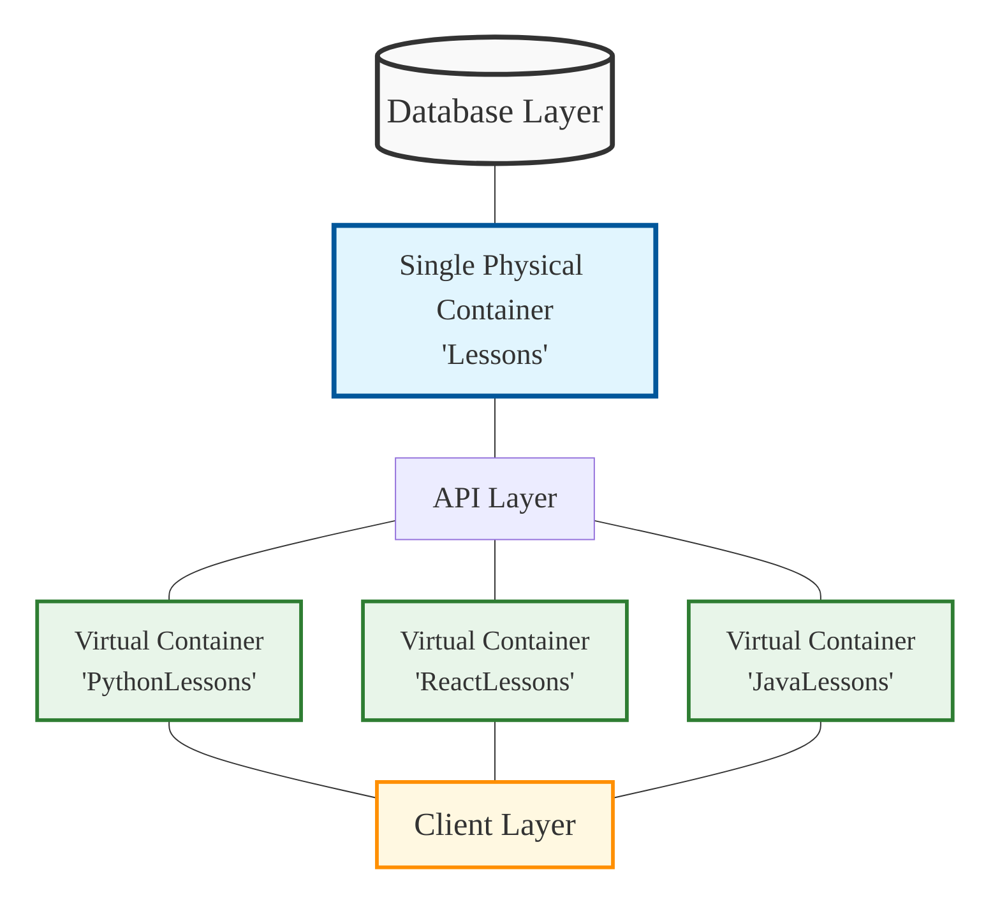
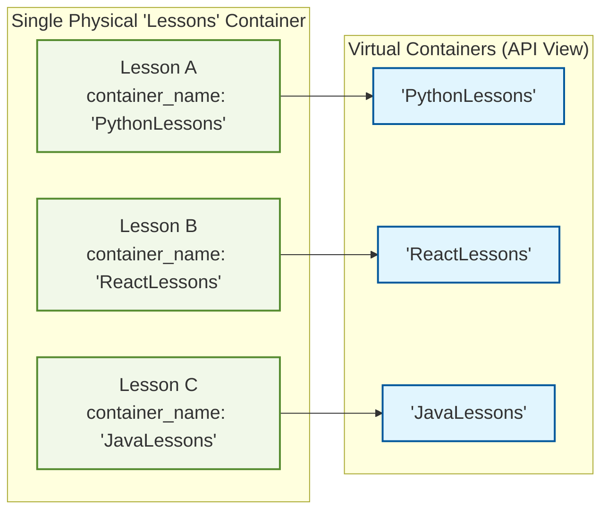

# Lesson Memory Container Architecture

## Overview

This document explains how the lesson memory container system is designed and how it organizes lesson entities within the knowledge graph. It illustrates the relationships between the physical database structure and the logical organization presented through the API.

## Container Architecture

The Lesson Memory system uses a single physical container named "Lessons" in the Neo4j database but presents a virtual organization system through container names. This approach combines the simplicity of unified storage with the flexibility of logical categorization.

### Key Concepts

1. **Single Physical Container**: There is only one actual container node in the database, always named "Lessons"
2. **Virtual Containers**: Different container_name values create logical groupings within the physical container
3. **Namespacing**: The container_name property on lesson entities enables filtering and organization
4. **Default Container**: When no container_name is specified, "Lessons" is used by default

## Architecture Diagram



### Detailed View of Container Architecture



> **Note**: To view these diagrams in full size, copy the Mermaid code and paste it into the [Mermaid Live Editor](https://mermaid.live/).

## Implementation Details

### Database Level

At the database level:
- All lesson entities are stored within a single Neo4j node labeled as a LessonContainer
- This container has the fixed name "Lessons" defined in LessonContainer.CONTAINER_NAME
- Each lesson entity has a property called "container_name" that defaults to "Lessons"
- The container_name property serves as a tag/namespace, not a pointer to a separate container

### API Level

At the API level:
- The container_name parameter is exposed in all lesson operations
- When a container_name is specified, it filters operations to that namespace
- The system presents these namespaces as if they were separate containers
- This creates an intuitive organization system without complicating the database structure

### Client Level

At the client level, there are two primary ways to interact with containers:

1. **Direct Usage with container_name**:
   ```python
   await lesson_memory_tool(
       operation_type="create",
       name="AsyncPatterns",
       lesson_type="BestPractice",
       container_name="ReactLessons"  # Specifies the virtual container
   )
   ```

2. **Context-based Usage**:
   ```python
   # Create a context with container information
   context_response = await lesson_memory_context({
       "project_name": "WebDev",
       "container_name": "ReactLessons"
   })
   context = json.loads(context_response)["context"]
   
   # Use the context in subsequent operations
   await lesson_memory_tool(
       operation_type="create",
       name="HookRules",
       lesson_type="BestPractice",
       container_name=context["container_name"]
   )
   ```

## Best Practices

1. **Organization Strategy**: Use different container names to organize lessons by domain, project, or knowledge type
2. **Consistency**: Within a single application, maintain consistent container naming
3. **Default Usage**: For simple applications, using the default "Lessons" container is recommended
4. **Context Management**: For multiple operations on the same container, use the lesson_memory_context approach
5. **Documentation**: Document which container names your application uses to avoid fragmentation

## Cross-Project Knowledge Sharing

A key strength of the lesson memory architecture is the ability to share and apply knowledge across different projects. Since all lessons exist in a single physical container in the database (regardless of their container_name property), there are no technical barriers to accessing and applying knowledge across projects.

### How Cross-Project Knowledge Sharing Works

1. **Unified Physical Storage**: All lessons are stored in the same physical container in the database, making them accessible regardless of their virtual container assignment.

2. **Cross-Container Search**: AI agents can search for relevant lessons across all containers:
   ```python
   # Search across all containers when no container_name is provided
   search_results = await lesson_memory_tool(
       operation_type="search",
       query="error handling patterns in asynchronous code"
       # No container_name specified = search across all containers
   )
   ```

3. **Explicit Cross-Project Relationships**: Lessons from different projects can be explicitly linked:
   ```python
   # Create relationship between lessons in different containers
   await lesson_memory_tool(
       operation_type="relate",
       source_name="DatabaseOptimizationInProjectA",  # In "ProjectALessons" container
       target_name="DatabaseSetupInProjectB",         # In "ProjectBLessons" container
       relationship_type="BUILDS_ON"
   )
   ```

4. **Knowledge Application Tracking**: The system can track when knowledge from one project is applied to another:
   ```python
   # Track application of lesson from one project to another
   await lesson_memory_tool(
       operation_type="track",
       entity_name="CachingPatterns",              # From "WebDevLessons" 
       application_context="MobileApp/DataLayer",  # Applied to mobile project
       success_score=0.9,
       notes="Applied web caching patterns to mobile offline storage"
   )
   ```

5. **Knowledge Evolution Across Projects**: The system can track how knowledge evolves and improves across different projects:
   ```python
   # Mark a lesson from ProjectB as superseding a lesson from ProjectA
   await lesson_memory_tool(
       operation_type="evolve",
       source_name="BasicCachingInProjectA",    # Original lesson
       target_name="AdvancedCachingInProjectB", # Improved lesson
       reason="Improved with distributed caching capabilities"
   )
   ```

### Benefits for AI Agents

This cross-project knowledge sharing capability is particularly valuable for AI agents that:

1. Work across multiple projects and need to apply lessons from previous work
2. Need to transfer domain knowledge from one area to another
3. Are tasked with improving solutions based on prior experiences
4. Need to avoid repeating mistakes encountered in previous projects

The virtual container design specifically supports this knowledge transfer while still maintaining organizational boundaries through the container_name property, giving you the best of both worlds: organization and cross-project learning.

## Conclusion

The lesson memory container architecture combines the efficiency of a single database container with the flexibility of virtual containers for organization. This design simplifies database management while providing intuitive categorization for clients.

By understanding this architecture, you can effectively organize your lessons into logical groupings while benefiting from the simplicity of a unified storage system. 