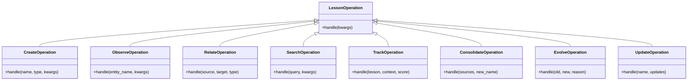

# Lesson Memory Integration Implementation Plan

## Overview

This document tracks the implementation progress of integrating the LessonMemoryManager into GraphMemoryManager using the Layered Access Approach. This integration will make the knowledge graph capabilities more accessible to AI agents while preserving human-like memory interaction patterns.

## Integration Approach

The implementation follows a layered approach with three key mechanisms:

1. ✅ **Direct Property Access** (already implemented)
   - Full access to LessonMemoryManager via `graph_manager.lesson_memory`
   - Provides complete functionality without abstraction

2. 🔄 **Operation Categories with Function Dispatching** 
   - Simplified interface for common operations
   - Single method entry point with operation type parameter
   - Consistent parameter handling

3. 🔄 **Context Management Wrapper**
   - Support for transaction-like operations with shared context
   - Project and container context preservation
   - Convenience methods for cleaner client code

### Architecture Diagram


## Implementation Tracking

### Phase 1: Operation Categories Implementation

Status: Complete

| Task | Status | Notes |
|------|--------|-------|
| Define operation categories and mappings | ✅ Complete | Defined in implementation plan |
| Implement `lesson_operation` dispatcher method | ✅ Complete | Basic dispatcher with error handling |
| Implement handler for "create" operations | ✅ Complete | Handles lesson entity creation |
| Implement handler for "observe" operations | ✅ Complete | Handles structured observations |
| Implement handler for "relate" operations | ✅ Complete | Handles creating relationships between lessons |
| Implement handler for "search" operations | ✅ Complete | Handles searching with semantic fallback |
| Implement handler for "track" operations | ✅ Complete | Handles lesson application tracking |
| Implement handler for "consolidate" operations | ✅ Complete | Handles merging multiple lessons |
| Implement handler for "evolve" operations | ✅ Complete | Handles tracking lesson supersession |
| Implement handler for "update" operations | ✅ Complete | Handles updating existing lessons |
| Add documentation and type hints | ✅ Complete | Added to implemented methods |
| Create unit tests | ⬜ Not Started | Will be addressed separately |

### Phase 2: Context Management Implementation

Status: Complete

| Task | Status | Notes |
|------|--------|-------|
| Create `LessonContext` helper class | ✅ Complete | Implemented with all core operations |
| Implement `lesson_context` context manager | ✅ Complete | Handles project context and restoration |
| Add context-aware create method | ✅ Complete | Simplifies lesson creation |
| Add context-aware observe method | ✅ Complete | Simplifies adding observations |
| Add context-aware relate method | ✅ Complete | Simplifies relationship creation |
| Add context-aware search method | ✅ Complete | Simplifies lesson searching |
| Add context-aware track method | ✅ Complete | Simplifies application tracking |
| Add context-aware update method | ✅ Complete | Simplifies lesson updates |
| Add documentation and type hints | ✅ Complete | Added to implemented methods |
| Create unit tests | ⬜ Not Started | Will be addressed separately |

### Phase 3: Integration and Testing

Status: Not Started

| Task | Status | Notes |
|------|--------|-------|
| Integrate both approaches in GraphMemoryManager | ✅ Complete | Both approaches implemented in GraphMemoryManager |
| Create integration tests | ⬜ Not Started | |
| Verify backward compatibility | ⬜ Not Started | |
| Perform benchmarking and optimization | ⬜ Not Started | |
| Update API documentation | ⬜ Not Started | |

### Phase 4: MCP Tool Creation

Status: Complete

| Task | Status | Notes |
|------|--------|-------|
| Create unified lesson memory tool | ✅ Complete | `lesson_memory_tool` function implemented |
| Add parameter documentation | ✅ Complete | Comprehensive docstrings with examples |
| Create examples | ✅ Complete | Multiple example use cases provided |
| Test with AI agents | ⬜ Not Started | Will be addressed separately |

## Implementation Details

### Operation Categories Design



```python
def lesson_operation(self, operation_type: str, **kwargs) -> str:
    """
    Single entry point for lesson operations.
    
    Args:
        operation_type: Type of operation to perform
        **kwargs: Operation-specific parameters
        
    Returns:
        JSON response string
    """
    operations = {
        "create": self._handle_lesson_creation,
        "observe": self._handle_lesson_observation,
        "relate": self._handle_lesson_relationship,
        "search": self._handle_lesson_search,
        "track": self._handle_lesson_tracking,
        "consolidate": self._handle_lesson_consolidation,
        "evolve": self._handle_lesson_evolution,
        "update": self._handle_lesson_update,
    }
    
    if operation_type not in operations:
        raise ValueError(f"Unknown operation type: {operation_type}")
        
    return operations[operation_type](**kwargs)
```

Example handler implementation:

```python
def _handle_lesson_creation(self, name, lesson_type, **kwargs):
    """
    Handle lesson creation with proper defaults and project context.
    
    Args:
        name: Name of the lesson to create
        lesson_type: Type of lesson entity
        **kwargs: Additional parameters
            - container_name: Optional container name (default: "Lessons")
            - observations: Optional list of observations
            - metadata: Optional metadata dictionary
    
    Returns:
        JSON response string with created lesson data
    """
    container = kwargs.pop("container_name", "Lessons")
    observations = kwargs.pop("observations", None)
    metadata = kwargs.pop("metadata", None)
    
    return self.lesson_memory.create_lesson_entity(
        container, name, lesson_type, observations, metadata
    )
```

### Context Management Design


```python
@contextmanager
def lesson_context(self, project_name=None, container_name=None):
    """
    Context manager for batch lesson operations with proper context.
    
    Args:
        project_name: Optional project name to set as context
        container_name: Optional container name to use
        
    Yields:
        LessonContext object with bound methods
    """
    original_project = self.default_project_name
    
    try:
        if project_name:
            self.set_project_name(project_name)
            
        context = LessonContext(self.lesson_memory, container_name)
        yield context
        
    finally:
        self.set_project_name(original_project)
```

### LessonContext Helper Class

```python
class LessonContext:
    """Helper class for context-bound lesson operations."""
    
    def __init__(self, lesson_memory, container_name=None):
        """
        Initialize with lesson memory manager and container context.
        
        Args:
            lesson_memory: The LessonMemoryManager instance
            container_name: Optional container name to use as context
        """
        self.lesson_memory = lesson_memory
        self.container_name = container_name or "Lessons"
    
    def create(self, name, lesson_type, **kwargs):
        """
        Create a lesson within this context.
        
        Args:
            name: Name of the lesson
            lesson_type: Type of the lesson
            **kwargs: Additional parameters
        
        Returns:
            JSON response with created lesson
        """
        return self.lesson_memory.create_lesson_entity(
            self.container_name, name, lesson_type, **kwargs
        )
    
    def observe(self, entity_name, **kwargs):
        """
        Add observations to a lesson within this context.
        
        Args:
            entity_name: Name of the entity to add observations to
            **kwargs: Observation fields (what_was_learned, why_it_matters, etc.)
        
        Returns:
            JSON response with observation results
        """
        kwargs["entity_name"] = entity_name
        kwargs["container_name"] = self.container_name
        return self.lesson_memory.create_structured_lesson_observations(**kwargs)
    
    # Additional methods would be implemented similarly
```

## Implementation Guidelines

### Operation Type Mapping

| Operation Type | LessonMemoryManager Methods | Purpose |
|----------------|---------------------------|---------|
| create | create_lesson_entity | Create new lesson entities |
| observe | create_structured_lesson_observations | Add structured observations to lessons |
| relate | create_lesson_relationship | Create relationships between lessons |
| search | search_lesson_semantic, search_lesson_entities | Find relevant lessons |
| track | track_lesson_application | Record where lessons were applied |
| consolidate | merge_lessons | Combine related lessons |
| evolve | track_lesson_supersession | Track lesson knowledge evolution |
| update | update_lesson_entity | Modify existing lessons |

### Parameter Standardization Guidelines

To ensure consistency across handler implementations:

1. **Common Parameters**:
   - All methods should accept `container_name` as an optional parameter
   - Use consistent name for entity identifiers (`entity_name` not `lesson_name`)
   - All methods should support an optional `metadata` parameter

2. **Parameter Processing**:
   - Use `kwargs.pop()` with defaults for optional parameters
   - Pass through unknown parameters to underlying methods where reasonable
   - Maintain parameter names consistent with LessonMemoryManager

3. **Return Values**:
   - All handlers should return JSON string responses
   - Parse and standardize response format when needed
   - Maintain consistency in response structure

### Error Handling Strategy

All operation handlers should:

1. Catch exceptions from LessonMemoryManager
2. Log errors with appropriate severity
3. Return standardized JSON error responses
4. Preserve original error messages where helpful
5. Add context information when propagating errors

Example error handling pattern:

```python
def _handle_operation(self, **kwargs):
    try:
        # Operation implementation
        return self.lesson_memory.some_method(**kwargs)
    except ValidationError as ve:
        self.logger.error(f"Validation error in operation: {str(ve)}")
        return json.dumps({
            "status": "error",
            "error": f"Invalid parameters: {str(ve)}",
            "code": "validation_error"
        })
    except Exception as e:
        self.logger.error(f"Error in operation: {str(e)}")
        return json.dumps({
            "status": "error",
            "error": f"Operation failed: {str(e)}",
            "code": "operation_error"
        })
```

### Backward Compatibility

This approach maintains compatibility with existing GraphMemoryManager methods:

| Existing Method | Relation to New Approach |
|----------------|--------------------------|
| create_lesson_container | Will remain, alongside operation_type="create" |
| get_lessons | Will be enhanced to use search operation internally |
| All entity methods | Will continue to work alongside new approach |

The new approach should be seen as a higher-level abstraction that complements rather than replaces existing methods.

### Import Requirements

For context management implementation, include these imports:

```python
from contextlib import contextmanager
import json
from typing import Dict, Any, Optional, List, Union
from pydantic import ValidationError
```

### Extending the Approach

When adding new operation types:

1. Add the operation type to the dispatch dictionary
2. Create a handler method following the established pattern
3. Document the new operation type
4. Update unit tests to cover the new operation 
5. Update this document with the new operation mapping

## MCP Tool Design

```python
def lesson_memory_tool(operation_type: str, **kwargs):
    """
    Manage lesson memory with a unified interface
    
    Args:
        operation_type: The type of operation to perform
          - create: Create a new lesson
          - observe: Add structured observations to a lesson
          - relate: Create relationships between lessons
          - search: Find relevant lessons
          - track: Track lesson application
        **kwargs: Operation-specific parameters
    """
    return graph_manager.lesson_operation(operation_type, **kwargs)
```

## Progress Tracking

Current Status: Phases 1, 2, and 4 Complete; Phase 3 In Progress
Next Steps: Complete Phase 3 (Integration and Testing)
Last Updated: [Current Date]

## References

- [GraphMemoryManager Implementation](../src/graph_memory/__init__.py)
- [LessonMemoryManager Implementation](../src/lesson_memory/__init__.py)
- [MCP Tools Documentation](../docs/mcp.md) 