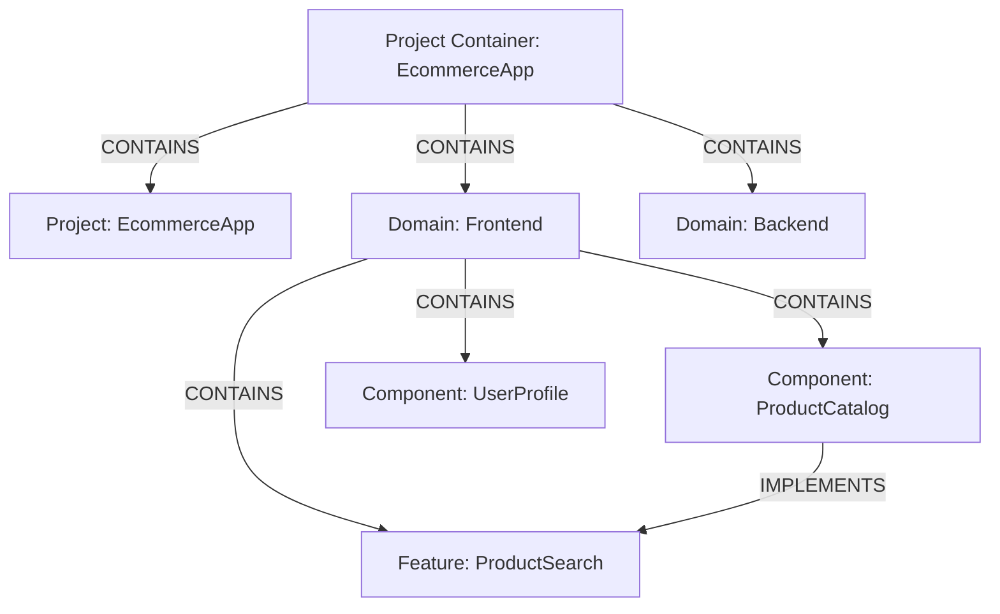

# Project Memory System Implementation

## Overview

The Project Memory system organizes knowledge in a way that mirrors human mental models. This document outlines the implementation details for hierarchical project memory management within the Neo4j Graph Memory architecture.

## Core Concepts

### Project Container

Each project has its own dedicated container:

```cypher
CREATE (pc:MemoryContainer {name: "ProjectName", type: "ProjectContainer", description: "Knowledge container for ProjectName"})
```



### Hierarchical Structure

Projects are organized in a hierarchical structure that mirrors human mental models:

```
(Project)
  └─(Domain)
      ├─(Component)
      │   └─(Implementation)
      ├─(Feature)
      │   └─(Requirement)
      └─(Decision)
          └─(Rationale)
```

### Entity Types

| Entity Type | Description | Properties |
|-------------|-------------|------------|
| Project | Top-level container | name, description, startDate, team, status, confidence |
| Domain | Logical subdivision of project | name, description, purpose, status, confidence |
| Component | Technical component | name, type, responsibility, status, maturity, confidence |
| Feature | User-facing functionality | name, description, priority, status, complexity, confidence |
| Requirement | Specification | description, source, priority, status, clarity, confidence |
| Decision | Architectural/design choice | description, date, alternatives, rationale, confidence, impact |
| Implementation | Code or system artifact | location, language, status, coverage, performance, confidence |
| Rationale | Reasoning for decisions | description, constraints, considerations, confidence |

### Relationship Types

| Relationship | Description | Properties |
|--------------|-------------|------------|
| CONTAINS | Hierarchical containment | since |
| IMPLEMENTS | Component implements feature | coverage, quality |
| DEPENDS_ON | Technical dependency | criticality, type |
| CONSTRAINS | Requirement constrains implementation | strictness, validation |
| AFFECTS | Decision affects component/feature | impact, direction |
| RELATES_TO | General relationship | strength, description |
| REPLACES | New version replaces old | compatibilityBreaking, migrationPath |
| HAS_RATIONALE | Links decision to its rationale | strength, completeness |
| EVOLVED_FROM | Entity evolved from previous version | changeType, significanceLevel |
| ASSOCIATED_WITH | Loose temporal or contextual association | description, relevance |

## Enhanced Implementation Details

### API Methods

#### 1. Create Project Container

```python
def create_project_container(
    project_name,
    description=None,
    start_date=None,
    team=None,
    metadata=None,
    confidence=0.9,
    tags=None
):
    """
    Create a project container for organizing project knowledge.
    """
    query = """
    MERGE (pc:MemoryContainer {name: $project_name, type: "ProjectContainer"})
    ON CREATE SET pc.created = datetime(),
                  pc.description = $description,
                  pc.startDate = $start_date,
                  pc.team = $team,
                  pc.confidence = $confidence,
                  pc.tags = $tags,
                  pc.lastUpdated = datetime()
    """
    # Execute query with parameters
    # Set as active project
```

#### 2. Add Domain to Project

```python
def add_domain(
    project_name,
    domain_name,
    description=None,
    purpose=None,
    confidence=0.9,
    status="Active"
):
    """
    Add a domain (logical subdivision) to a project.
    """
    # Create domain entity
    # Link to project container
```

#### 3. Add Component

```python
def add_component(
    project_name,
    component_name,
    domain_name=None,
    component_type=None,
    responsibility=None,
    status="Planned",
    confidence=0.8,
    maturity="Emerging",
    evolution_history=None
):
    """
    Add a technical component to a project/domain.
    """
    # Create component entity
    # Link to domain if provided
    # Link to project container
    # Record evolution history if provided
```

#### 4. Add Feature

```python
def add_feature(
    project_name,
    feature_name,
    domain_name=None,
    description=None,
    priority="Medium",
    status="Planned",
    requirements=[],
    confidence=0.8,
    complexity="Medium",
    metrics=None
):
    """
    Add a feature to a project/domain.
    """
    # Create feature entity
    # Link to domain if provided
    # Link to project container
    # Create requirements if provided
    # Associate metrics if provided
```

#### 5. Record Decision

```python
def record_decision(
    project_name,
    decision_name,
    description,
    alternatives=None,
    rationale=None,
    affects=None,
    confidence=0.8,
    impact="Medium",
    decision_date=None,
    review_date=None
):
    """
    Record a design/architecture decision.
    """
    # Create decision entity
    # Create rationale entity if provided
    # Link to affected components/features if provided
    # Link to project container
    # Set review date if provided
```

#### 6. Create Relationship

```python
def create_project_relationship(
    from_entity,
    to_entity,
    relationship_type,
    properties=None,
    confidence=0.9,
    evidence=None
):
    """
    Create a relationship between project entities.
    """
    # Create relationship with properties
    # Record confidence in relationship
    # Store evidence/justification if provided
```

#### 7. Retrieve Project Structure

```python
def get_project_structure(
    project_name,
    include_entities=True,
    include_relationships=True,
    depth=3,
    min_confidence=0.0,
    entity_types=None
):
    """
    Retrieve the hierarchical structure of a project.
    """
    # Query with variable depth traversal
    # Filter by confidence if required
    # Return structured representation
```

#### 8. Track Entity Evolution

```python
def track_entity_evolution(
    entity_name,
    entity_type=None,
    start_date=None,
    end_date=None,
    include_related=False,
    include_metrics=True
):
    """
    Track how a project entity has evolved over time.
    
    Returns:
        Chronological timeline of an entity's changes and development
    """
    # Query entity history with temporal constraints
    # Include related entities if requested
    # Include metrics history if available
    # Return chronological timeline
```

#### 9. Automate Structure Discovery

```python
def discover_project_structure(
    code_base_path=None,
    documentation_path=None,
    repository_url=None,
    confidence_threshold=0.7
):
    """
    Automatically discover and build project structure from code and documentation.
    
    Args:
        code_base_path: Path to source code
        documentation_path: Path to documentation
        repository_url: URL to source repository
        confidence_threshold: Minimum confidence to include discovered elements
        
    Returns:
        Discovered project structure with confidence scores
    """
    # Analyze code structure
    # Parse documentation
    # Identify components and relationships
    # Assign confidence scores to discoveries
    # Return structured results
```

#### 10. Consolidate Project Knowledge

```python
def consolidate_project_entities(
    entity_type,
    entity_ids,
    new_name=None,
    strategy="merge",
    confidence_handling="weighted"
):
    """
    Combine multiple similar entities into a unified entity.
    
    Args:
        entity_type: Type of entity to consolidate
        entity_ids: List of entity IDs to combine
        new_name: Name for consolidated entity
        strategy: How to combine properties
        confidence_handling: How to set confidence level
        
    Returns:
        ID of the consolidated entity
    """
    # Retrieve entities to consolidate
    # Create new entity with combined properties
    # Establish consolidation relationships
    # Update references to point to new entity
    # Set appropriate confidence level
```

#### 11. Cross-Project Knowledge Transfer

```python
def transfer_knowledge(
    source_project,
    target_project,
    entity_types=None,
    min_confidence=0.7,
    adaptation_strategy="reference"
):
    """
    Transfer relevant knowledge from one project to another.
    
    Args:
        source_project: Project to transfer knowledge from
        target_project: Project to transfer knowledge to
        entity_types: Types of entities to transfer (None for all)
        min_confidence: Minimum confidence level for transfer
        adaptation_strategy: How to adapt knowledge ("reference" or "copy")
        
    Returns:
        Summary of transferred knowledge
    """
    # Identify transferable knowledge
    # Create appropriate relationships or copies
    # Adapt knowledge to target context if needed
    # Return summary of transfer operation
```

### Cypher Queries

#### Project Setup with Confidence

```cypher
// Create project container with confidence
MERGE (pc:MemoryContainer {name: $project_name, type: "ProjectContainer"})
ON CREATE SET pc.created = datetime(),
              pc.description = $description,
              pc.startDate = $start_date,
              pc.confidence = $confidence,
              pc.lastUpdated = datetime()

// Create project entity with confidence
MERGE (p:Entity {name: $project_name, entityType: "Project"})
ON CREATE SET p.created = datetime(),
              p.description = $description,
              p.startDate = $start_date,
              p.team = $team,
              p.confidence = $confidence,
              p.status = "Active",
              p.lastUpdated = datetime()

// Link project to container
MERGE (pc)-[:CONTAINS {since: datetime()}]->(p)
```

#### Adding Domain with Confidence

```cypher
// Create domain entity with confidence
MERGE (d:Entity {name: $domain_name, entityType: "Domain"})
ON CREATE SET d.created = datetime(),
              d.description = $description,
              d.purpose = $purpose,
              d.confidence = $confidence,
              d.status = $status,
              d.lastUpdated = datetime()

// Link to project with timestamp
MATCH (p:Entity {name: $project_name, entityType: "Project"})
MERGE (p)-[:CONTAINS {since: datetime()}]->(d)

// Link to project container
MATCH (pc:MemoryContainer {name: $project_name, type: "ProjectContainer"})
MERGE (pc)-[:CONTAINS {since: datetime()}]->(d)
```

#### Adding Component with Dependencies and Evolution History

```cypher
// Create component with confidence and maturity
MERGE (c:Entity {name: $component_name, entityType: "Component"})
ON CREATE SET c.created = datetime(),
              c.type = $component_type,
              c.responsibility = $responsibility,
              c.status = $status,
              c.confidence = $confidence,
              c.maturity = $maturity,
              c.lastUpdated = datetime()

// Link to domain if provided
OPTIONAL MATCH (d:Entity {name: $domain_name, entityType: "Domain"})
WITH c, d
WHERE d IS NOT NULL
MERGE (d)-[:CONTAINS {since: datetime()}]->(c)

// Link to project container
MATCH (pc:MemoryContainer {name: $project_name, type: "ProjectContainer"})
MERGE (pc)-[:CONTAINS {since: datetime()}]->(c)

// Create dependencies with criticality
UNWIND $dependencies as dep
MATCH (dep_entity:Entity {name: dep.name, entityType: "Component"})
MERGE (c)-[:DEPENDS_ON {
  criticality: dep.criticality,
  type: dep.type,
  since: datetime(),
  confidence: coalesce(dep.confidence, 0.8)
}]->(dep_entity)

// Record evolution history if provided
UNWIND $evolution_history as history_item
MATCH (predecessor:Entity {name: history_item.predecessor_name})
MERGE (c)-[:EVOLVED_FROM {
  date: datetime(history_item.date),
  changeType: history_item.change_type,
  significance: history_item.significance,
  confidence: coalesce(history_item.confidence, 0.8)
}]->(predecessor)
```

#### Recording Decision with Confidence and Temporal Tracking

```cypher
// Create decision entity with confidence
MERGE (d:Entity {name: $decision_name, entityType: "Decision"})
ON CREATE SET d.created = datetime(),
              d.description = $description,
              d.alternatives = $alternatives,
              d.confidence = $confidence,
              d.impact = $impact,
              d.decisionDate = coalesce($decision_date, datetime()),
              d.reviewDate = $review_date,
              d.lastUpdated = datetime()

// Create rationale with confidence
MERGE (r:Entity {name: $decision_name + "_Rationale", entityType: "Rationale"})
ON CREATE SET r.created = datetime(),
              r.description = $rationale,
              r.constraints = $constraints,
              r.confidence = $confidence,
              r.lastUpdated = datetime()

// Link decision to rationale with strength measure
MERGE (d)-[:HAS_RATIONALE {
  strength: coalesce($rationale_strength, "Strong"),
  confidence: $confidence
}]->(r)

// Link to affected entities with impact assessment
UNWIND $affects as affected
MATCH (a:Entity {name: affected.name})
MERGE (d)-[:AFFECTS {
  impact: affected.impact,
  direction: affected.direction,
  confidence: coalesce(affected.confidence, $confidence)
}]->(a)

// Link to project container
MATCH (pc:MemoryContainer {name: $project_name, type: "ProjectContainer"})
MERGE (pc)-[:CONTAINS {since: datetime()}]->(d)
MERGE (pc)-[:CONTAINS {since: datetime()}]->(r)
```

#### Entity Evolution Tracking Query

```cypher
// Track evolution of an entity over time
MATCH (e:Entity {name: $entity_name})
WHERE e.entityType = $entity_type OR $entity_type IS NULL

// Get evolution chain
OPTIONAL MATCH (e)<-[evolved:EVOLVED_FROM*]-(newer:Entity)
WITH e, collect(newer) as future_versions

// Get past versions
OPTIONAL MATCH (e)-[evolved_from:EVOLVED_FROM*]->(older:Entity)
WITH e, future_versions, collect(older) as past_versions

// Get changes to the entity itself
MATCH (e)
WITH e, future_versions, past_versions, 
     [x in range(0, size(e)-1) | {
        property: keys(e)[x],
        value: e[keys(e)[x]],
        timestamp: coalesce(e.lastUpdated, e.created)
     }] as current_properties

// Get relationships changes
OPTIONAL MATCH (e)-[r]->(other)
WHERE type(r) <> 'EVOLVED_FROM'
WITH e, future_versions, past_versions, current_properties,
     collect({
       type: type(r),
       target: other.name,
       properties: properties(r),
       timestamp: coalesce(r.since, e.lastUpdated, e.created)
     }) as outgoing_relationships

// Get status changes and metrics if available
OPTIONAL MATCH (e)-[:HAS_METRIC]->(m:Metric)
WITH e, future_versions, past_versions, current_properties, outgoing_relationships,
     collect({
       type: m.type,
       value: m.value,
       timestamp: m.timestamp
     }) as metrics

// Combine everything into a timeline
WITH e, future_versions, past_versions, current_properties, outgoing_relationships, metrics
RETURN {
  name: e.name,
  type: e.entityType,
  current: current_properties,
  past_versions: [{name: v.name, changed: v.lastUpdated} for v in past_versions],
  future_versions: [{name: v.name, changed: v.created} for v in future_versions],
  relationships: outgoing_relationships,
  metrics: metrics
} as evolution
```

#### Automated Structure Discovery

```cypher
// Store discovered components with confidence
UNWIND $discovered_components as component
MERGE (c:Entity {name: component.name, entityType: "Component"})
ON CREATE SET c.created = datetime(),
              c.type = component.type,
              c.responsibility = component.responsibility,
              c.confidence = component.confidence,
              c.source = "Automated",
              c.evidence = component.evidence,
              c.lastUpdated = datetime()

// Link to project container
MATCH (pc:MemoryContainer {name: $project_name, type: "ProjectContainer"})
MERGE (pc)-[:CONTAINS {
  since: datetime(),
  confidence: component.confidence,
  discovery_method: "Automated"
}]->(c)

// Create discovered relationships with confidence
UNWIND $discovered_relationships as rel
MATCH (from:Entity {name: rel.from})
MATCH (to:Entity {name: rel.to})
CALL apoc.create.relationship(from, rel.type, {
  confidence: rel.confidence,
  evidence: rel.evidence,
  discovered: datetime(),
  source: "Automated"
}, to) YIELD rel as created_rel
RETURN count(created_rel)
```

#### Knowledge Consolidation Query

```cypher
// Create consolidated entity
CREATE (consolidated:Entity {
  name: $new_name,
  entityType: $entity_type,
  created: datetime(),
  description: $combined_description,
  status: "Active",
  confidence: $calculated_confidence,
  source: "Consolidated",
  lastUpdated: datetime()
})

// Mark source entities as consolidated
UNWIND $entity_ids as entity_id
MATCH (e:Entity {name: entity_id})
WHERE e.entityType = $entity_type
SET e.status = "Consolidated"
CREATE (consolidated)-[:CONSOLIDATES {date: datetime()}]->(e)

// Copy relevant properties
UNWIND $entity_ids as entity_id
MATCH (e:Entity {name: entity_id})
WHERE e.entityType = $entity_type
UNWIND keys(e) as key
WITH consolidated, e, key
WHERE key <> "name" AND key <> "entityType" AND key <> "status" AND key <> "created"
  AND NOT exists(consolidated[key])
SET consolidated[key] = e[key]

// Migrate relationships
UNWIND $entity_ids as entity_id
MATCH (e:Entity {name: entity_id})-[r]->(target)
WHERE NOT (consolidated)-[:CONSOLIDATES]->(target)
  AND NOT exists((consolidated)-[{type: type(r)}]->(target))
WITH consolidated, target, type(r) as rel_type, e, r
CALL apoc.create.relationship(consolidated, rel_type, properties(r), target) YIELD rel
RETURN count(rel)
```

#### Cross-Project Knowledge Transfer

```cypher
// Identify transferable entities based on confidence
MATCH (source_pc:MemoryContainer {name: $source_project, type: "ProjectContainer"})
MATCH (target_pc:MemoryContainer {name: $target_project, type: "ProjectContainer"})
MATCH (source_pc)-[:CONTAINS]->(entity)
WHERE entity.confidence >= $min_confidence
  AND (entity.entityType IN $entity_types OR $entity_types IS NULL)
  AND NOT exists((target_pc)-[:CONTAINS]->(:Entity {name: entity.name}))

// For reference strategy, create references to original entities
WITH source_pc, target_pc, entity
WHERE $adaptation_strategy = "reference"
MERGE (target_pc)-[:REFERENCES {
  since: datetime(),
  confidence: entity.confidence,
  source_project: $source_project
}]->(entity)

// For copy strategy, duplicate entities
WITH source_pc, target_pc, entity
WHERE $adaptation_strategy = "copy"
CREATE (copy:Entity)
SET copy = entity
SET copy.name = entity.name + " (from " + $source_project + ")"
SET copy.originalSource = $source_project
SET copy.transferred = datetime()
MERGE (target_pc)-[:CONTAINS {
  since: datetime(),
  originalSource: $source_project
}]->(copy)

// Return summary of transfer operations
RETURN count(entity) as entities_transferred
```

## Cross-Container Queries

### Multi-Project View

```cypher
// Query across multiple projects
MATCH (container:MemoryContainer)
WHERE container.type = "ProjectContainer" 
  AND container.name IN $project_names
MATCH (container)-[:CONTAINS]->(entity)
WHERE entity.confidence >= $confidence_threshold
  AND entity.entityType IN $entity_types
RETURN container.name as project,
       collect({
         name: entity.name,
         type: entity.entityType,
         confidence: entity.confidence,
         status: entity.status
       }) as entities
```

### Cross-Project Comparison

```cypher
// Compare components across projects
MATCH (pc1:MemoryContainer {name: $project1, type: "ProjectContainer"})
MATCH (pc2:MemoryContainer {name: $project2, type: "ProjectContainer"})
MATCH (pc1)-[:CONTAINS]->(c1:Entity {entityType: "Component"})
MATCH (pc2)-[:CONTAINS]->(c2:Entity {entityType: "Component"})
WHERE c1.type = c2.type OR c1.responsibility = c2.responsibility
RETURN c1.name as project1_component,
       c2.name as project2_component,
       c1.type as type,
       c1.responsibility as project1_responsibility,
       c2.responsibility as project2_responsibility,
       apoc.text.similarity(c1.responsibility, c2.responsibility) as similarity
ORDER BY similarity DESC
LIMIT 10
```

### Project-Lesson Integration

```cypher
// Find lessons relevant to project components
MATCH (pc:MemoryContainer {name: $project_name, type: "ProjectContainer"})
MATCH (lc:MemoryContainer {type: "LessonsContainer"})
MATCH (pc)-[:CONTAINS]->(component:Entity {entityType: "Component"})
MATCH (lc)-[:CONTAINS]->(lesson:Entity {entityType: "Lesson"})
WHERE component.confidence >= $confidence_threshold
  AND lesson.confidence >= $confidence_threshold
WITH component, lesson,
     apoc.text.similarity(component.responsibility, lesson.problemDescription) as similarity
WHERE similarity >= 0.6
  OR exists((lesson)-[:APPLIES_TO]->(component))
  OR exists((lesson)-[:ORIGINATED_FROM]->(component))
RETURN component.name as component,
       collect({
         name: lesson.name,
         problem: lesson.problemDescription,
         relevance: similarity,
         explicitly_connected: exists((lesson)-[:APPLIES_TO]->(component)) OR exists((lesson)-[:ORIGINATED_FROM]->(component))
       }) as relevant_lessons
ORDER BY component.name
```

## Data Migration and Integration

For existing project entities, migration scripts provide:

1. Addition of confidence and temporal properties
2. Organization into hierarchical container structure
3. Establishment of evolution tracking relationships
4. Integration with the Lessons Memory system

### Integration with Lessons System

```python
# Link project components to relevant lessons
def integrate_lessons_with_project(project_name, min_confidence=0.7):
    """
    Integrate lessons from the global lesson container with project components.
    
    Args:
        project_name: Name of the project
        min_confidence: Minimum confidence threshold for relationships
    
    Returns:
        Summary of integration operations
    """
    # Find relevant lessons for project components
    # Establish appropriate relationships
    # Set confidence levels based on relevance
    # Return integration summary
```

## Usage Example

```python
# Create a project with confidence
create_project_container(
    project_name="EcommerceApp",
    description="Online retail platform",
    start_date="2023-10-01",
    team=["John", "Alice", "Bob"],
    confidence=0.95,
    tags=["ecommerce", "retail", "web"]
)

# Add domains with confidence
add_domain(
    project_name="EcommerceApp",
    domain_name="Frontend",
    purpose="User interface and experience",
    confidence=0.9,
    status="Active"
)

# Add components with evolution history
add_component(
    project_name="EcommerceApp",
    domain_name="Frontend",
    component_name="ProductCatalog",
    component_type="React Component",
    responsibility="Display product listings and search results",
    confidence=0.85,
    maturity="Stable",
    evolution_history=[
        {
            "predecessor_name": "ProductGrid",
            "date": "2023-09-15",
            "change_type": "Enhancement",
            "significance": "Major"
        }
    ]
)

# Record decision with confidence and review date
record_decision(
    project_name="EcommerceApp",
    decision_name="UseGraphQL",
    description="Use GraphQL for API queries",
    alternatives=["REST API", "gRPC"],
    rationale="Reduces overfetching and provides type safety",
    affects=[
        {"name": "ProductCatalog", "impact": "High", "direction": "Positive"},
        {"name": "Backend", "impact": "High", "direction": "Neutral"}
    ],
    confidence=0.8,
    impact="High",
    decision_date="2023-10-05",
    review_date="2024-04-05"
)

# Automatically discover project structure
discovered_structure = discover_project_structure(
    code_base_path="/path/to/ecommerce/src",
    documentation_path="/path/to/ecommerce/docs",
    confidence_threshold=0.75
)

# Consolidate similar components
consolidate_project_entities(
    entity_type="Component",
    entity_ids=["ShoppingCart", "CartWidget", "MiniCart"],
    new_name="UnifiedCartComponent",
    strategy="merge",
    confidence_handling="weighted"
)

# Track how a component has evolved
component_history = track_entity_evolution(
    entity_name="ProductCatalog",
    entity_type="Component",
    start_date="2023-01-01",
    include_metrics=True
)

# Transfer knowledge between projects
transfer_result = transfer_knowledge(
    source_project="EcommerceApp",
    target_project="MarketplaceApp",
    entity_types=["Component", "Decision"],
    min_confidence=0.8,
    adaptation_strategy="reference"
)

# Find lessons relevant to project components
project_lessons = integrate_lessons_with_project(
    project_name="EcommerceApp",
    min_confidence=0.7
)

# Compare components across projects
component_comparison = query_across_contexts(
    query_text="Product catalog implementation",
    containers=["EcommerceApp", "MarketplaceApp", "RetailDashboard"],
    confidence_threshold=0.7,
    limit_per_container=5
)
``` 

# Implementation progess

## 2025-03-27
- Initial documentation created 🏛️
  - Defined hierarchical structure for project memory
  - Outlined entity and relationship types
  - Created sample API methods and Cypher queries