# Project Memory Integration Implementation Plan

## Overview

This document tracks the implementation progress of integrating the ProjectMemoryManager into GraphMemoryManager using the Layered Access Approach. This integration will make the project knowledge graph capabilities more accessible to AI agents while preserving human-like memory interaction patterns.

## Integration Approach

The implementation follows a layered approach with three key mechanisms:

1. ✅ **Direct Property Access** (already implemented)
   - Full access to ProjectMemoryManager via `graph_manager.project_memory`
   - Provides complete functionality without abstraction

2. 🔄 **Operation Categories with Function Dispatching** 
   - Simplified interface for common operations
   - Single method entry point with operation type parameter
   - Consistent parameter handling

3. 🔄 **Context Management Wrapper**
   - Support for transaction-like operations with shared context
   - Project context preservation
   - Convenience methods for cleaner client code

### Architecture Diagram


## Implementation Tracking

### Phase 1: Operation Categories Implementation

Status: Not Started

| Task | Status | Notes |
|------|--------|-------|
| Define operation categories and mappings | ⬜ Not Started | |
| Implement `project_operation` dispatcher method | ⬜ Not Started | |
| Implement handler for "create_project" operations | ⬜ Not Started | |
| Implement handler for "create_component" operations | ⬜ Not Started | |
| Implement handler for "create_domain_entity" operations | ⬜ Not Started | |
| Implement handler for "relate_entities" operations | ⬜ Not Started | |
| Implement handler for "search" operations | ⬜ Not Started | |
| Implement handler for "get_structure" operations | ⬜ Not Started | |
| Implement handler for "add_observation" operations | ⬜ Not Started | |
| Implement handler for "update" operations | ⬜ Not Started | |
| Add documentation and type hints | ⬜ Not Started | |
| Create unit tests | ⬜ Not Started | |

### Phase 2: Context Management Implementation

Status: Not Started

| Task | Status | Notes |
|------|--------|-------|
| Create `ProjectContext` helper class | ⬜ Not Started | |
| Implement `project_context` context manager | ⬜ Not Started | |
| Add context-aware create_project method | ⬜ Not Started | |
| Add context-aware create_component method | ⬜ Not Started | |
| Add context-aware create_domain_entity method | ⬜ Not Started | |
| Add context-aware relate_entities method | ⬜ Not Started | |
| Add context-aware search method | ⬜ Not Started | |
| Add context-aware get_structure method | ⬜ Not Started | |
| Add documentation and type hints | ⬜ Not Started | |
| Create unit tests | ⬜ Not Started | |

### Phase 3: Integration and Testing

Status: Not Started

| Task | Status | Notes |
|------|--------|-------|
| Integrate both approaches in GraphMemoryManager | ⬜ Not Started | |
| Create integration tests | ⬜ Not Started | |
| Verify backward compatibility | ⬜ Not Started | |
| Perform benchmarking and optimization | ⬜ Not Started | |
| Update API documentation | ⬜ Not Started | |

### Phase 4: MCP Tool Creation

Status: Not Started

| Task | Status | Notes |
|------|--------|-------|
| Create unified project memory tool | ⬜ Not Started | |
| Add parameter documentation | ⬜ Not Started | |
| Create examples | ⬜ Not Started | |
| Test with AI agents | ⬜ Not Started | |

## Implementation Details

### Operation Categories Design

```mermaid
classDiagram
    class ProjectOperation {
        +handle(kwargs)
    }
    
    ProjectOperation <|-- CreateProjectOperation
    ProjectOperation <|-- CreateComponentOperation
    ProjectOperation <|-- CreateDomainEntityOperation
    ProjectOperation <|-- RelateEntitiesOperation
    ProjectOperation <|-- SearchOperation
    ProjectOperation <|-- GetStructureOperation
    ProjectOperation <|-- AddObservationOperation
    ProjectOperation <|-- UpdateOperation
    
    CreateProjectOperation : +handle(name, description, kwargs)
    CreateComponentOperation : +handle(project_id, name, component_type, kwargs)
    CreateDomainEntityOperation : +handle(project_id, entity_type, name, kwargs)
    RelateEntitiesOperation : +handle(source_id, target_id, relation_type, kwargs)
    SearchOperation : +handle(query, kwargs)
    GetStructureOperation : +handle(project_id, kwargs)
    AddObservationOperation : +handle(entity_id, content, kwargs)
    UpdateOperation : +handle(entity_id, updates)
```



```python
def project_operation(self, operation_type: str, **kwargs) -> str:
    """
    Single entry point for project memory operations.
    
    Args:
        operation_type: Type of operation to perform
        **kwargs: Operation-specific parameters
        
    Returns:
        JSON response string
    """
    operations = {
        "create_project": self._handle_project_creation,
        "create_component": self._handle_component_creation,
        "create_domain_entity": self._handle_domain_entity_creation,
        "relate_entities": self._handle_entity_relationship,
        "search": self._handle_project_search,
        "get_structure": self._handle_structure_retrieval,
        "add_observation": self._handle_add_observation,
        "update": self._handle_entity_update,
    }
    
    if operation_type not in operations:
        raise ValueError(f"Unknown operation type: {operation_type}")
        
    return operations[operation_type](**kwargs)
```

Example handler implementation:

```python
def _handle_project_creation(self, name: str, **kwargs):
    """
    Handle project creation with proper defaults.
    
    Args:
        name: Name of the project to create
        **kwargs: Additional parameters
            - description: Optional description
            - metadata: Optional metadata dictionary
            - tags: Optional list of tags
    
    Returns:
        JSON response string with created project data
    """
    description = kwargs.pop("description", None)
    metadata = kwargs.pop("metadata", None)
    tags = kwargs.pop("tags", None)
    
    result = self.project_memory.create_project_container(
        name, description, metadata, tags
    )
    
    # Ensure string return
    if isinstance(result, str):
        return result
    else:
        return json.dumps(result)
```

### Context Management Design


```python
@contextmanager
def project_context(self, project_name=None):
    """
    Context manager for batch project operations with proper context.
    
    Args:
        project_name: Project name to set as context
        
    Yields:
        ProjectContext object with bound methods
    """
    original_project = self.default_project_name
    
    try:
        if project_name:
            self.set_project_name(project_name)
            
        context = ProjectContext(self.project_memory, project_name)
        yield context
        
    finally:
        self.set_project_name(original_project)
```

### ProjectContext Helper Class

```python
class ProjectContext:
    """Helper class for context-bound project operations."""
    
    def __init__(self, project_memory, project_name=None):
        """
        Initialize with project memory manager and project context.
        
        Args:
            project_memory: The ProjectMemoryManager instance
            project_name: Optional project name to use as context
        """
        self.project_memory = project_memory
        self.project_name = project_name
    
    def create_component(self, name: str, component_type: str, **kwargs) -> str:
        """
        Create a component within this project context.
        
        Args:
            name: Name of the component
            component_type: Type of the component
            **kwargs: Additional parameters
        
        Returns:
            JSON response with created component
        """
        result = self.project_memory.create_component(
            project_id=self.project_name,
            name=name,
            component_type=component_type,
            **kwargs
        )
        
        # Ensure string return
        if isinstance(result, str):
            return result
        else:
            return json.dumps(result)
    
    # Additional methods would be implemented similarly
```

## Implementation Guidelines

### Operation Type Mapping

| Operation Type | ProjectMemoryManager Methods | Purpose |
|----------------|----------------------------|---------|
| create_project | create_project_container | Create new project containers |
| create_component | create_component | Create components within projects |
| create_domain_entity | create_domain_entity | Create domain entities (decisions, requirements, etc.) |
| relate_entities | create_component_relationship, create_entity_relationship | Create relationships between entities |
| search | search_project_entities | Find relevant project entities |
| get_structure | get_project_structure | Retrieve project hierarchy |
| add_observation | add_entity_observation | Add observations to entities |
| update | update_component, update_domain_entity | Modify existing entities |

### Parameter Standardization Guidelines

To ensure consistency across handler implementations:

1. **Common Parameters**:
   - All methods should accept `project_id` or `project_name` as a parameter
   - Use consistent name for entity identifiers (`entity_id`, `component_id`)
   - All methods should support an optional `metadata` parameter

2. **Parameter Processing**:
   - Use `kwargs.pop()` with defaults for optional parameters
   - Pass through unknown parameters to underlying methods where reasonable
   - Maintain parameter names consistent with ProjectMemoryManager

3. **Return Values**:
   - All handlers should return JSON string responses
   - Parse and standardize response format when needed
   - Maintain consistency in response structure

### Error Handling Strategy

All operation handlers should:

1. Catch exceptions from ProjectMemoryManager
2. Log errors with appropriate severity
3. Return standardized JSON error responses
4. Preserve original error messages where helpful
5. Add context information when propagating errors

Example error handling pattern:

```python
def _handle_operation(self, **kwargs):
    try:
        # Operation implementation
        result = self.project_memory.some_method(**kwargs)
        
        # Ensure string return
        if isinstance(result, str):
            return result
        else:
            return json.dumps(result)
            
    except ValidationError as ve:
        self.logger.error(f"Validation error in project operation: {str(ve)}")
        return json.dumps({
            "status": "error",
            "error": f"Invalid parameters: {str(ve)}",
            "code": "validation_error"
        })
    except Exception as e:
        self.logger.error(f"Error in project operation: {str(e)}")
        return json.dumps({
            "status": "error",
            "error": f"Operation failed: {str(e)}",
            "code": "operation_error"
        })
```

### Backward Compatibility

This approach maintains compatibility with existing GraphMemoryManager methods:

| Existing Method | Relation to New Approach |
|----------------|--------------------------|
| create_project_container | Will remain, alongside operation_type="create_project" |
| get_project_entities | Will be enhanced to use search operation internally |
| All project entity methods | Will continue to work alongside new approach |

The new approach should be seen as a higher-level abstraction that complements rather than replaces existing methods.

### Import Requirements

For context management implementation, include these imports:

```python
from contextlib import contextmanager
import json
from typing import Dict, Any, Optional, List, Union
from pydantic import ValidationError
```

### Extending the Approach

When adding new operation types:

1. Add the operation type to the dispatch dictionary
2. Create a handler method following the established pattern
3. Document the new operation type
4. Update unit tests to cover the new operation 
5. Update this document with the new operation mapping

## MCP Tool Design

```python
def project_memory_tool(operation_type: str, **kwargs):
    """
    Manage project memory with a unified interface
    
    Args:
        operation_type: The type of operation to perform
          - create_project: Create a new project
          - create_component: Create a component within a project
          - create_domain_entity: Create a domain entity
          - relate_entities: Create relationships between entities
          - search: Find relevant project entities
          - get_structure: Retrieve project hierarchy
          - add_observation: Add observations to entities
          - update: Update existing entities
        **kwargs: Operation-specific parameters
    """
    return graph_manager.project_operation(operation_type, **kwargs)
```

## Progress Tracking

Current Status: Planning Phase
Next Steps: Begin Phase 1 implementation
Last Updated: [Current Date]

## References

- [GraphMemoryManager Implementation](../src/graph_memory/__init__.py)
- [ProjectMemoryManager Implementation](../src/project_memory/__init__.py)
- [MCP Tools Documentation](../docs/mcp.md) 